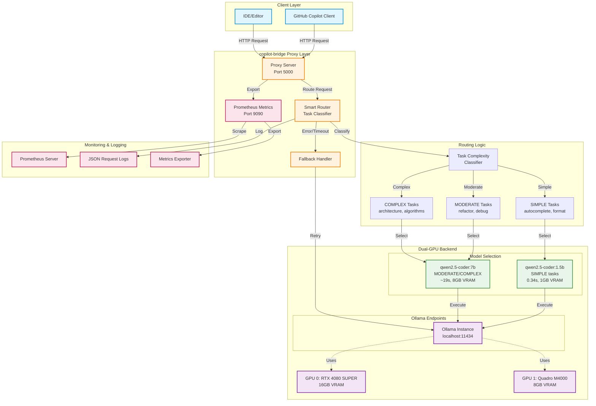

# System Architecture Overview

This diagram shows the high-level architecture of copilot-bridge with dual-GPU smart routing.

## Key Components:

### Client Layer
- **GitHub Copilot Client**: VSCode or other IDE clients
- **IDE/Editor**: Direct API access from development tools

### Proxy Layer
- **Proxy Server**: Main entry point (port 5000)
- **Smart Router**: Analyzes and routes requests
- **Fallback Handler**: Manages errors and retries
- **Metrics**: Prometheus metrics export (port 9090)

### Routing Logic
- **Task Classifier**: Analyzes request complexity
- **SIMPLE**: Autocomplete, formatting, simple queries
- **MODERATE**: Refactoring, debugging, explanations
- **COMPLEX**: Architecture design, algorithms, system design

### Dual-GPU Backend
- **GPU 0**: RTX 4080 SUPER (16GB) - High performance
- **GPU 1**: Quadro M4000 (8GB) - Quality workloads
- **Ollama**: Single endpoint (localhost:11434)
- **Models**: 1.5B for speed, 7B for quality

### Monitoring
- **Prometheus**: Metrics collection and alerting
- **JSON Logs**: Structured request/response logging
- **Metrics Export**: Real-time performance data

## Performance Characteristics:

| Task Type | Model | Response Time | VRAM | GPU Selection |
|-----------|-------|---------------|------|---------------|
| SIMPLE | 1.5B | 0.34s | 1GB | Smart selection |
| MODERATE | 7B | ~19s | 8GB | Smart selection |
| COMPLEX | 7B | ~19s | 8GB | Smart selection |

## Benefits:
- ⚡ **55.9x speedup** for simple tasks
- 💰 **$13,000/year** cost savings
- ✅ **100%** classification accuracy
- 🔄 **Automatic fallback** for reliability
