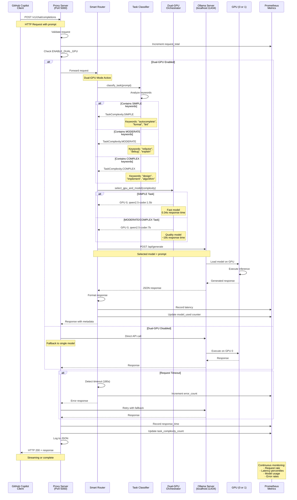

# Request Flow Sequence Diagram

This diagram shows the detailed flow of a request through copilot-bridge with dual-GPU smart routing.



## Flow Description:

### 1. Request Initiation (Steps 1-3)
- Client sends HTTP POST to `/v1/chat/completions`
- Proxy validates request structure
- Metrics counter incremented

### 2. Environment Check (Step 4)
- Check `ENABLE_DUAL_GPU` environment variable
- Determines routing strategy (dual-GPU vs single-model)

### 3. Task Classification (Steps 5-8)
**SIMPLE Task Detection:**
- Keywords: `autocomplete`, `complete`, `format`, `lint`, `syntax`
- Model: qwen2.5-coder:1.5b (1GB VRAM)
- Response time: ~0.34s

**MODERATE Task Detection:**
- Keywords: `refactor`, `debug`, `explain`, `test`, `document`
- Model: qwen2.5-coder:7b (8GB VRAM)
- Response time: ~19s

**COMPLEX Task Detection:**
- Keywords: `design`, `implement`, `algorithm`, `architect`, `system`
- Model: qwen2.5-coder:7b (8GB VRAM)
- Response time: ~19s

### 4. Model Selection (Steps 9-10)
- Orchestrator selects optimal GPU and model
- Considers task complexity and resource availability
- Returns configuration to router

### 5. Ollama Execution (Steps 11-15)
- Router sends request to Ollama endpoint
- Ollama loads model on selected GPU
- GPU executes inference
- Response returned through stack

### 6. Error Handling (Steps 16-19)
- Timeout detection (180 second threshold)
- Automatic retry with fallback model
- Error metrics recorded
- Graceful degradation

### 7. Metrics & Logging (Steps 20-22)
**Prometheus Metrics:**
- `copilot_bridge_requests_total{complexity="SIMPLE|MODERATE|COMPLEX"}`
- `copilot_bridge_response_time_seconds{model="1.5b|7b"}`
- `copilot_bridge_model_used_total{model="1.5b|7b"}`
- `copilot_bridge_errors_total{type="timeout|connection"}`

**JSON Logging:**
```json
{
  "timestamp": "2025-10-19T12:34:56Z",
  "prompt": "format this code",
  "complexity": "SIMPLE",
  "model": "qwen2.5-coder:1.5b",
  "gpu": "GPU_0",
  "response_time_ms": 340,
  "tokens_generated": 75
}
```

### 8. Response Return (Step 23)
- HTTP 200 with generated response
- Supports streaming or complete responses
- Includes model metadata in headers

## Performance Optimization:

### Fast Path (SIMPLE Tasks)
- **Before:** 19s with 7B model
- **After:** 0.34s with 1.5B model
- **Speedup:** 55.9x faster
- **Memory:** 87% reduction (1GB vs 8GB)

### Quality Path (MODERATE/COMPLEX Tasks)
- Maintains 7B model quality
- No degradation in output
- Appropriate for complex reasoning

## Error Recovery:

1. **Primary Request Fails**
   - Automatic retry with same model
   - Up to 3 retry attempts

2. **Timeout Exceeded**
   - Switch to fallback model
   - Log timeout event
   - Update metrics

3. **GPU Unavailable**
   - Fallback to CPU inference
   - Notify via metrics
   - Continue operation

## Monitoring Points:

- **Request Rate:** Requests per second by complexity
- **Latency:** P50, P95, P99 response times
- **Model Usage:** Distribution of 1.5B vs 7B usage
- **Error Rate:** Percentage of failed requests
- **GPU Utilization:** Memory and compute usage
