# Deployment and Integration Architecture

This diagram shows how copilot-bridge integrates with various environments and deployment scenarios.

```mermaid
graph TB
    subgraph "Development Environment"
        DEV_IDE[VS Code / IDE]
        DEV_COPILOT[GitHub Copilot<br/>Extension]
        DEV_BRIDGE[copilot-bridge<br/>Local Instance]
        DEV_OLLAMA[Ollama Local<br/>localhost:11434]
        DEV_GPU[Local GPU<br/>Development]
    end

    subgraph "Production Environment"
        subgraph "Load Balancer Layer"
            LB[Load Balancer<br/>nginx/HAProxy]
        end
        
        subgraph "Proxy Cluster"
            PROXY1[copilot-bridge<br/>Instance 1<br/>Port 5000]
            PROXY2[copilot-bridge<br/>Instance 2<br/>Port 5001]
            PROXY3[copilot-bridge<br/>Instance 3<br/>Port 5002]
        end
        
        subgraph "Ollama Cluster"
            OLLAMA1[Ollama Instance 1<br/>GPU Node 1]
            OLLAMA2[Ollama Instance 2<br/>GPU Node 2]
            OLLAMA3[Ollama Instance 3<br/>GPU Node 3]
        end
        
        subgraph "GPU Resources"
            GPU_POOL[GPU Pool<br/>Multiple RTX/Quadro GPUs]
        end
        
        subgraph "Monitoring Stack"
            PROM[Prometheus]
            GRAFANA[Grafana<br/>Dashboards]
            ALERT[AlertManager]
        end
        
        subgraph "Logging Stack"
            LOKI[Loki]
            LOG_AGGREGATOR[Log Aggregator]
        end
    end

    subgraph "Configuration Management"
        ENV_CONFIG[Environment Variables<br/>• ENABLE_DUAL_GPU<br/>• GPU0_URL<br/>• GPU1_URL<br/>• OLLAMA_HOST]
        CONFIG_FILE[config.yaml<br/>Model Configurations]
        SECRETS[Secrets Manager<br/>API Keys]
    end

    subgraph "External Services"
        GITHUB[GitHub API<br/>Copilot Service]
        CLOUD_LLM[Cloud LLM Providers<br/>Backup/Fallback]
    end

    subgraph "Client Applications"
        CLIENT1[Development Team 1]
        CLIENT2[Development Team 2]
        CLIENT3[Development Team 3]
    end

    %% Development flow
    DEV_IDE --> DEV_COPILOT
    DEV_COPILOT --> DEV_BRIDGE
    DEV_BRIDGE --> DEV_OLLAMA
    DEV_OLLAMA --> DEV_GPU

    %% Production flow
    CLIENT1 --> LB
    CLIENT2 --> LB
    CLIENT3 --> LB
    
    LB --> PROXY1
    LB --> PROXY2
    LB --> PROXY3
    
    PROXY1 --> OLLAMA1
    PROXY1 --> OLLAMA2
    PROXY2 --> OLLAMA2
    PROXY2 --> OLLAMA3
    PROXY3 --> OLLAMA1
    PROXY3 --> OLLAMA3
    
    OLLAMA1 --> GPU_POOL
    OLLAMA2 --> GPU_POOL
    OLLAMA3 --> GPU_POOL
    
    %% Configuration
    ENV_CONFIG -.->|Configure| PROXY1
    ENV_CONFIG -.->|Configure| PROXY2
    ENV_CONFIG -.->|Configure| PROXY3
    CONFIG_FILE -.->|Model Config| OLLAMA1
    CONFIG_FILE -.->|Model Config| OLLAMA2
    CONFIG_FILE -.->|Model Config| OLLAMA3
    SECRETS -.->|API Keys| PROXY1
    
    %% Monitoring
    PROXY1 -->|Metrics| PROM
    PROXY2 -->|Metrics| PROM
    PROXY3 -->|Metrics| PROM
    PROM --> GRAFANA
    PROM --> ALERT
    
    %% Logging
    PROXY1 -->|Logs| LOG_AGGREGATOR
    PROXY2 -->|Logs| LOG_AGGREGATOR
    PROXY3 -->|Logs| LOG_AGGREGATOR
    LOG_AGGREGATOR --> LOKI
    LOKI --> GRAFANA
    
    %% External services
    PROXY1 -.->|Fallback| CLOUD_LLM
    PROXY2 -.->|Fallback| CLOUD_LLM
    PROXY3 -.->|Fallback| CLOUD_LLM
    
    %% GitHub integration
    CLIENT1 -.->|Optional| GITHUB
    CLIENT2 -.->|Optional| GITHUB
    CLIENT3 -.->|Optional| GITHUB
    
    %% Styling
    classDef devStyle fill:#e3f2fd,stroke:#1976d2,stroke-width:2px
    classDef prodStyle fill:#f3e5f5,stroke:#7b1fa2,stroke-width:2px
    classDef configStyle fill:#fff3e0,stroke:#f57c00,stroke-width:2px
    classDef monitorStyle fill:#e8f5e9,stroke:#388e3c,stroke-width:2px
    classDef externalStyle fill:#fce4ec,stroke:#c2185b,stroke-width:2px
    
    class DEV_IDE,DEV_COPILOT,DEV_BRIDGE,DEV_OLLAMA,DEV_GPU devStyle
    class LB,PROXY1,PROXY2,PROXY3,OLLAMA1,OLLAMA2,OLLAMA3,GPU_POOL prodStyle
    class ENV_CONFIG,CONFIG_FILE,SECRETS configStyle
    class PROM,GRAFANA,ALERT,LOKI,LOG_AGGREGATOR monitorStyle
    class GITHUB,CLOUD_LLM,CLIENT1,CLIENT2,CLIENT3 externalStyle
```



## Deployment Scenarios:

### 1. Development Environment (Blue)

**Components:**
- **IDE**: VS Code or JetBrains with GitHub Copilot extension
- **copilot-bridge**: Single local instance
- **Ollama**: Local installation on `localhost:11434`
- **GPU**: Developer's local GPU (RTX 3060+)

**Setup:**
```bash
# Install dependencies
pip install -r requirements.txt

# Configure environment
export ENABLE_DUAL_GPU=true
export GPU0_URL="http://localhost:11434"
export GPU1_URL="http://localhost:11434"

# Start copilot-bridge
python3 proxy_dual_gpu_integrated.py --port 5000

# Configure Copilot extension
# Set API endpoint to: http://localhost:5000
```

**Use Cases:**
- Local development and testing
- Feature development
- Model experimentation
- Individual developer use

---

### 2. Production Environment (Purple)

#### Load Balancer Configuration

**nginx Configuration:**
```nginx
upstream copilot_bridge_backend {
    least_conn;  # Load balancing algorithm
    
    server 192.168.1.101:5000 max_fails=3 fail_timeout=30s;
    server 192.168.1.102:5001 max_fails=3 fail_timeout=30s;
    server 192.168.1.103:5002 max_fails=3 fail_timeout=30s;
}

server {
    listen 443 ssl http2;
    server_name copilot-bridge.company.com;
    
    ssl_certificate /etc/nginx/ssl/cert.pem;
    ssl_certificate_key /etc/nginx/ssl/key.pem;
    
    location / {
        proxy_pass http://copilot_bridge_backend;
        proxy_http_version 1.1;
        proxy_set_header Upgrade $http_upgrade;
        proxy_set_header Connection 'upgrade';
        proxy_set_header Host $host;
        proxy_cache_bypass $http_upgrade;
        
        # Timeout for long-running LLM requests
        proxy_connect_timeout 300s;
        proxy_send_timeout 300s;
        proxy_read_timeout 300s;
    }
    
    location /metrics {
        proxy_pass http://copilot_bridge_backend/metrics;
        allow 192.168.1.0/24;  # Prometheus server
        deny all;
    }
}
```

#### Proxy Cluster Configuration

**Instance 1 (Primary):**
```bash
# /etc/systemd/system/copilot-bridge-1.service
[Unit]
Description=Copilot Bridge Instance 1
After=network.target

[Service]
Type=simple
User=copilot
WorkingDirectory=/opt/copilot-bridge
Environment="ENABLE_DUAL_GPU=true"
Environment="GPU0_URL=http://gpu-node-1.internal:11434"
Environment="GPU1_URL=http://gpu-node-2.internal:11434"
Environment="PROMETHEUS_PORT=9090"
ExecStart=/usr/bin/python3 proxy_dual_gpu_integrated.py --port 5000
Restart=always
RestartSec=10

[Install]
WantedBy=multi-user.target
```

**Instance 2 (Secondary):**
```bash
Environment="GPU0_URL=http://gpu-node-2.internal:11434"
Environment="GPU1_URL=http://gpu-node-3.internal:11434"
ExecStart=/usr/bin/python3 proxy_dual_gpu_integrated.py --port 5001
```

**Instance 3 (Tertiary):**
```bash
Environment="GPU0_URL=http://gpu-node-1.internal:11434"
Environment="GPU1_URL=http://gpu-node-3.internal:11434"
ExecStart=/usr/bin/python3 proxy_dual_gpu_integrated.py --port 5002
```

#### Ollama Cluster

**GPU Node 1:**
```bash
# 2x RTX 4080 SUPER (16GB each)
# Runs: qwen2.5-coder:1.5b, qwen2.5-coder:7b
CUDA_VISIBLE_DEVICES=0,1 ollama serve --host 0.0.0.0:11434
```

**GPU Node 2:**
```bash
# 2x RTX 4090 (24GB each)
# Runs: qwen2.5-coder:7b, larger models
CUDA_VISIBLE_DEVICES=0,1 ollama serve --host 0.0.0.0:11434
```

**GPU Node 3:**
```bash
# 4x RTX A6000 (48GB each)
# Runs: qwen2.5-coder:7b, qwen2.5-coder:32b
CUDA_VISIBLE_DEVICES=0,1,2,3 ollama serve --host 0.0.0.0:11434
```

---

### 3. Configuration Management (Orange)

#### Environment Variables

**Required:**
```bash
ENABLE_DUAL_GPU=true           # Enable smart routing
GPU0_URL=http://gpu-node-1.internal:11434
GPU1_URL=http://gpu-node-2.internal:11434
OLLAMA_HOST=http://localhost:11434
```

**Optional:**
```bash
PROMETHEUS_PORT=9090           # Metrics port
LOG_LEVEL=INFO                 # Logging verbosity
TIMEOUT_SECONDS=180            # Request timeout
MAX_RETRIES=3                  # Retry attempts
FALLBACK_ENABLED=true          # Enable cloud fallback
CLOUD_API_KEY=sk-xxx           # Cloud LLM API key
```

#### Configuration File (`config.yaml`)

```yaml
models:
  simple:
    name: "qwen2.5-coder:1.5b"
    vram_gb: 1
    expected_latency_ms: 340
    gpu_preference: 0
    
  complex:
    name: "qwen2.5-coder:7b-instruct-q8_0"
    vram_gb: 8
    expected_latency_ms: 19000
    gpu_preference: 0

routing:
  classification:
    simple_keywords:
      - autocomplete
      - complete
      - format
      - lint
    moderate_keywords:
      - refactor
      - debug
      - explain
    complex_keywords:
      - design
      - implement
      - architect
      
  thresholds:
    timeout_seconds: 180
    max_retries: 3
    
monitoring:
  prometheus:
    enabled: true
    port: 9090
  
  logging:
    format: json
    level: INFO
    destination: /var/log/copilot-bridge/
```

---

### 4. Monitoring Stack (Green)

#### Prometheus Configuration

```yaml
# prometheus.yml
global:
  scrape_interval: 15s
  evaluation_interval: 15s

scrape_configs:
  - job_name: 'copilot-bridge'
    static_configs:
      - targets:
        - 'proxy-1.internal:9090'
        - 'proxy-2.internal:9090'
        - 'proxy-3.internal:9090'
    metrics_path: '/metrics'
    
  - job_name: 'ollama'
    static_configs:
      - targets:
        - 'gpu-node-1.internal:11435'  # Ollama metrics
        - 'gpu-node-2.internal:11435'
        - 'gpu-node-3.internal:11435'

alerting:
  alertmanagers:
    - static_configs:
        - targets:
          - 'alertmanager.internal:9093'

rule_files:
  - 'alerts.yml'
```

#### Alert Rules

```yaml
# alerts.yml
groups:
  - name: copilot_bridge_alerts
    interval: 30s
    rules:
      - alert: HighErrorRate
        expr: |
          rate(copilot_bridge_errors_total[5m]) > 0.1
        for: 5m
        labels:
          severity: warning
        annotations:
          summary: "High error rate on {{ $labels.instance }}"
          
      - alert: HighLatency
        expr: |
          histogram_quantile(0.95,
            rate(copilot_bridge_response_time_seconds_bucket[5m])
          ) > 30
        for: 5m
        labels:
          severity: warning
        annotations:
          summary: "P95 latency > 30s on {{ $labels.instance }}"
          
      - alert: GPUMemoryHigh
        expr: |
          gpu_memory_used_bytes / gpu_memory_total_bytes > 0.9
        for: 2m
        labels:
          severity: critical
        annotations:
          summary: "GPU memory > 90% on {{ $labels.gpu }}"
```

#### Grafana Dashboards

**Dashboard 1: Overview**
- Request rate (requests/sec)
- P50, P95, P99 latency
- Error rate percentage
- Model usage distribution

**Dashboard 2: Performance**
- Response time by complexity
- GPU utilization
- VRAM usage
- Throughput metrics

**Dashboard 3: Business Metrics**
- Cost savings calculation
- Time saved per developer
- ROI tracking
- Usage patterns

---

### 5. Integration Points

#### GitHub Copilot Integration

**VS Code settings.json:**
```json
{
  "github.copilot.advanced": {
    "debug.overrideEngine": "copilot-codex",
    "debug.overrideProxyUrl": "http://copilot-bridge.company.com",
    "debug.testOverrideProxyUrl": "http://copilot-bridge.company.com"
  }
}
```

#### Cloud LLM Fallback

**Supported Providers:**
- OpenAI GPT-4
- Anthropic Claude
- Google PaLM
- Azure OpenAI

**Fallback Configuration:**
```python
FALLBACK_PROVIDERS = [
    {
        "name": "openai",
        "api_key": os.getenv("OPENAI_API_KEY"),
        "model": "gpt-4-turbo",
        "enabled": True
    },
    {
        "name": "anthropic",
        "api_key": os.getenv("ANTHROPIC_API_KEY"),
        "model": "claude-3-opus",
        "enabled": False
    }
]
```

---

## Scaling Strategies:

### Horizontal Scaling
- Add more proxy instances behind load balancer
- Scale Ollama cluster with additional GPU nodes
- Distribute load based on complexity

### Vertical Scaling
- Upgrade to higher-end GPUs (A100, H100)
- Increase VRAM capacity
- Optimize model quantization

### Cost Optimization
- Use SIMPLE model (1.5B) for 80% of requests
- Reserve 7B model for quality-critical tasks
- Scale down during off-peak hours

---

## Security Considerations:

### Network Security
- TLS/SSL encryption for all traffic
- VPN for internal communication
- Firewall rules for GPU nodes

### Authentication
- API key validation
- JWT tokens for client authentication
- Role-based access control (RBAC)

### Data Privacy
- No prompt logging in production (optional)
- Encrypted storage for logs
- GDPR compliance

---

## High Availability:

### Redundancy
- Multiple proxy instances (N+1)
- Multiple Ollama instances (N+2)
- Cross-AZ deployment

### Health Checks
```bash
# Proxy health endpoint
curl http://proxy-1.internal:5000/health

# Ollama health check
curl http://gpu-node-1.internal:11434/api/health
```

### Automatic Failover
- Load balancer detects failures
- Removes unhealthy instances
- Redistributes traffic automatically

---

## Performance Benchmarks:

| Metric | Single Instance | 3-Instance Cluster | 10-Instance Cluster |
|--------|----------------|-------------------|---------------------|
| Max RPS | 50 | 150 | 500 |
| P95 Latency | 2.5s | 1.8s | 1.2s |
| Availability | 95% | 99.5% | 99.95% |
| Cost/Month | $500 | $1,500 | $5,000 |
| Developers Supported | 10 | 30 | 100 |
